# Technical Diagrams

This document contains all technical diagrams for the AcademicHub project.

## Table of Contents

1. [Architecture Diagrams](#architecture-diagrams)
2. [Sequence Diagrams](#sequence-diagrams)
3. [Entity Relationship Diagrams](#entity-relationship-diagrams)
4. [State Diagrams](#state-diagrams)
5. [Deployment Diagrams](#deployment-diagrams)

---

## Architecture Diagrams

### System Architecture Overview

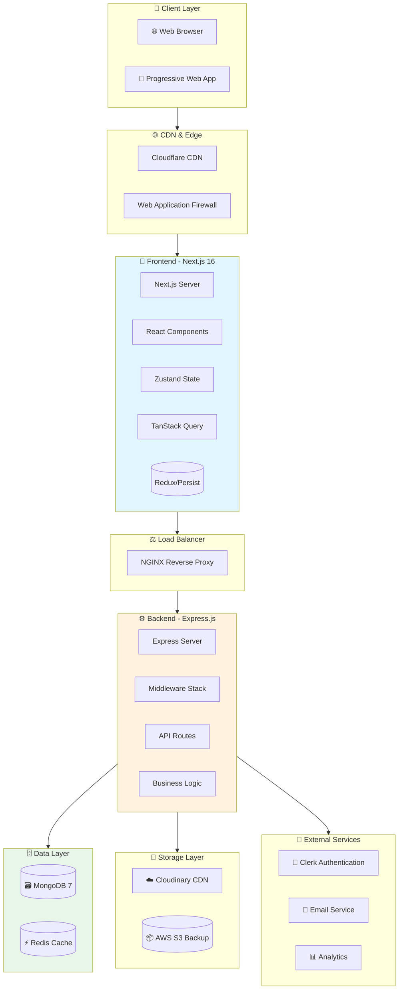

### Data Flow Architecture

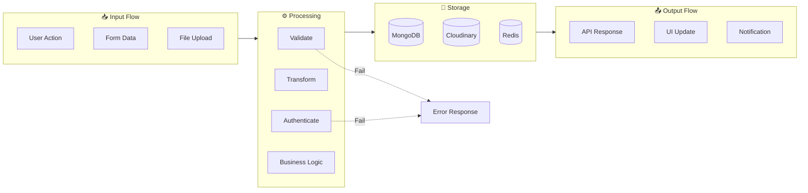

---

## Sequence Diagrams

### User Authentication Flow

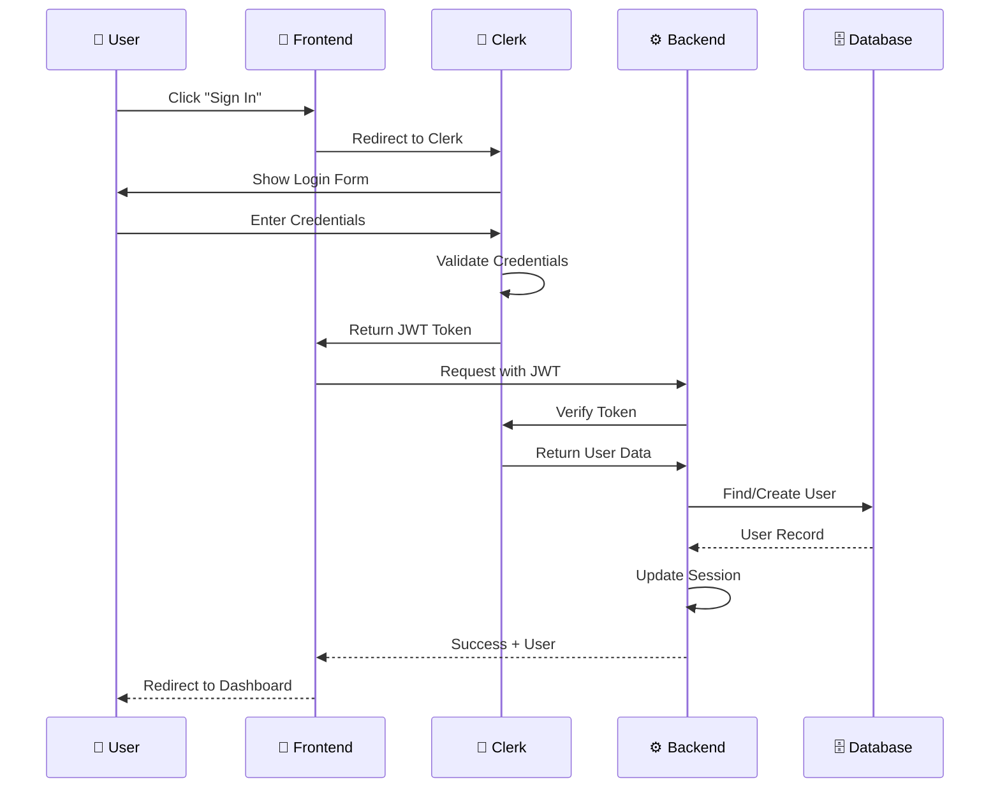

### Content Upload Flow

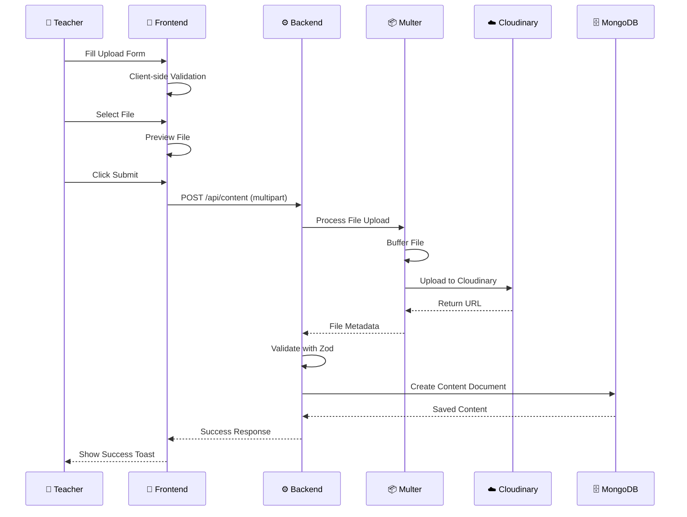

### Content Search Flow

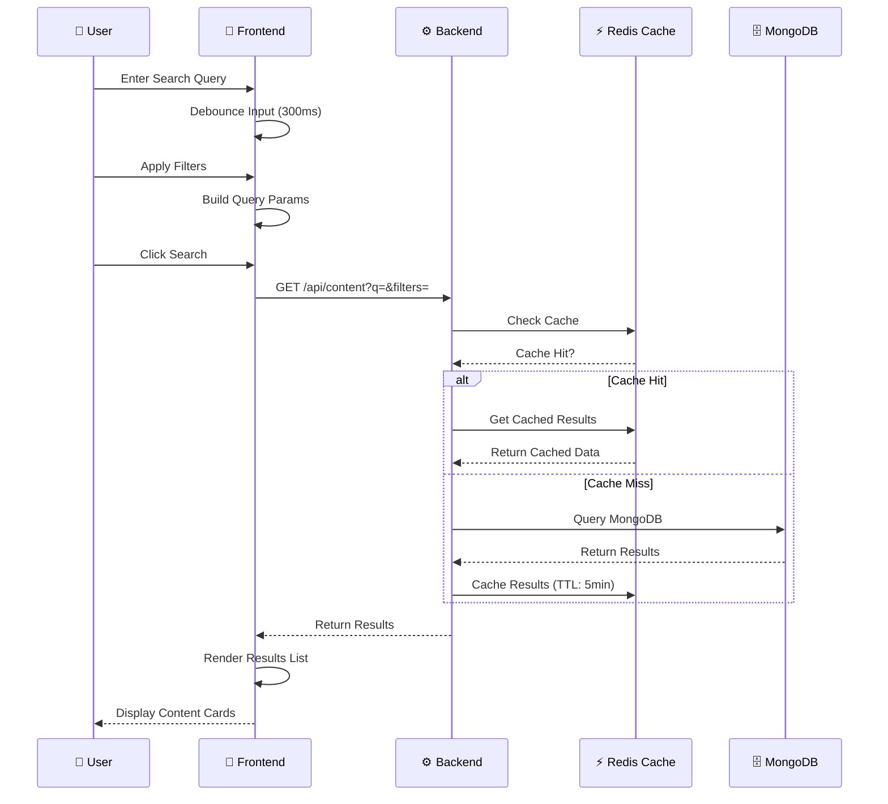

---

## Entity Relationship Diagrams

### Complete Data Model

```mermaid
erDiagram
    USER ||--o{ CONTENT : "creates"
    USER ||--o{ SESSION : "has"
    USER {
        string _id PK
        string clerkUserId UK
        string email UK NN
        string name
        string avatar_url
        enum role FK
        datetime created_at
        datetime updated_at
    }
    
    ROLE ||--o{ USER : "assigned to"
    ROLE {
        string _id PK
        string name UK NN
        string permissions JSON
    }
    
    CONTENT ||--o{ CONTENT_TAG : "tagged with"
    CONTENT ||--|| USER : "uploaded by"
    CONTENT ||--o| CATEGORY : "belongs to"
    CONTENT {
        string _id PK
        string title NN
        string description
        enum type FK
        string file_url
        string file_type
        int file_size
        string branch FK
        int semester
        string subject
        ObjectId uploaded_by FK
        int downloads default 0
        int views default 0
        bool is_active default true
        datetime created_at
        datetime updated_at
    }
    
    CATEGORY ||--o{ CONTENT : "categorizes"
    CATEGORY {
        string _id PK
        string name UK NN
        string type NN
        bool is_active default true
    }
    
    TAG ||--o{ CONTENT_TAG : "used in"
    TAG {
        string _id PK
        string name UK
        int usage_count default 0
    }
    
    CONTENT_TAG ||--|| CONTENT : ""
    CONTENT_TAG ||--|| TAG : ""
    CONTENT_TAG {
        ObjectId content_id FK
        ObjectId tag_id FK
    }
    
    SESSION ||--|| USER : "belongs to"
    SESSION {
        string _id PK
        ObjectId user_id FK
        string token
        datetime expires_at
        string ip_address
        string user_agent
    }
    
    AUDIT_LOG ||--|| USER : "performed by"
    AUDIT_LOG {
        string _id PK
        ObjectId user_id FK
        string action
        string resource
        string details JSON
        datetime created_at
    }
```

---

## State Diagrams

### Content Lifecycle

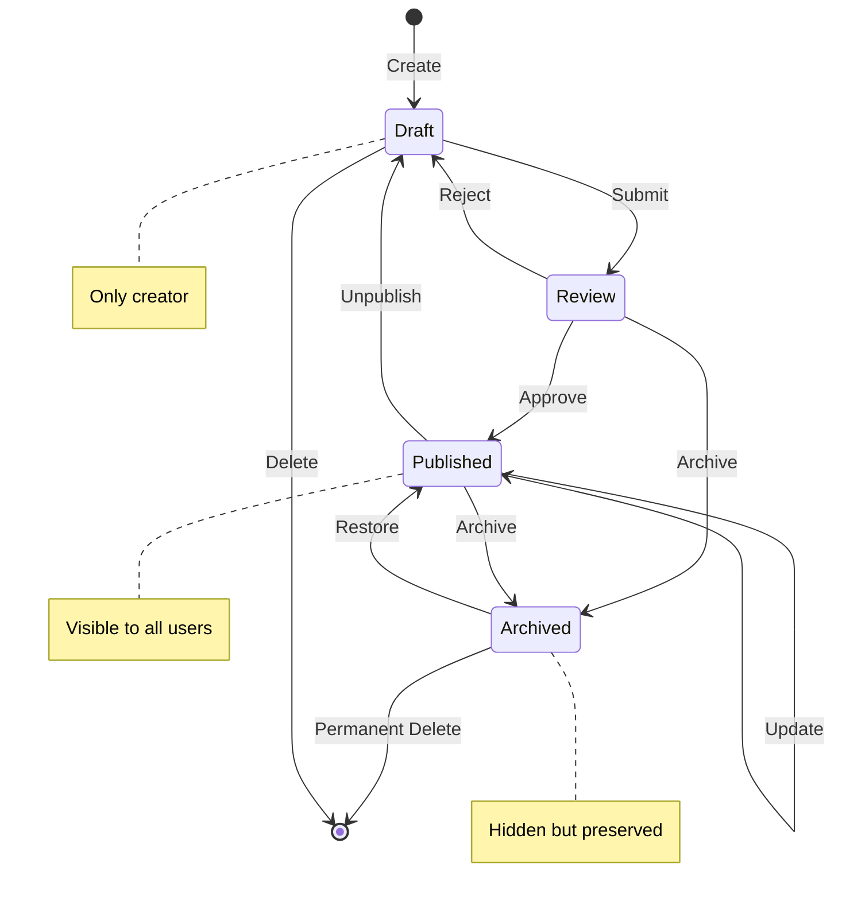

### User Authentication States

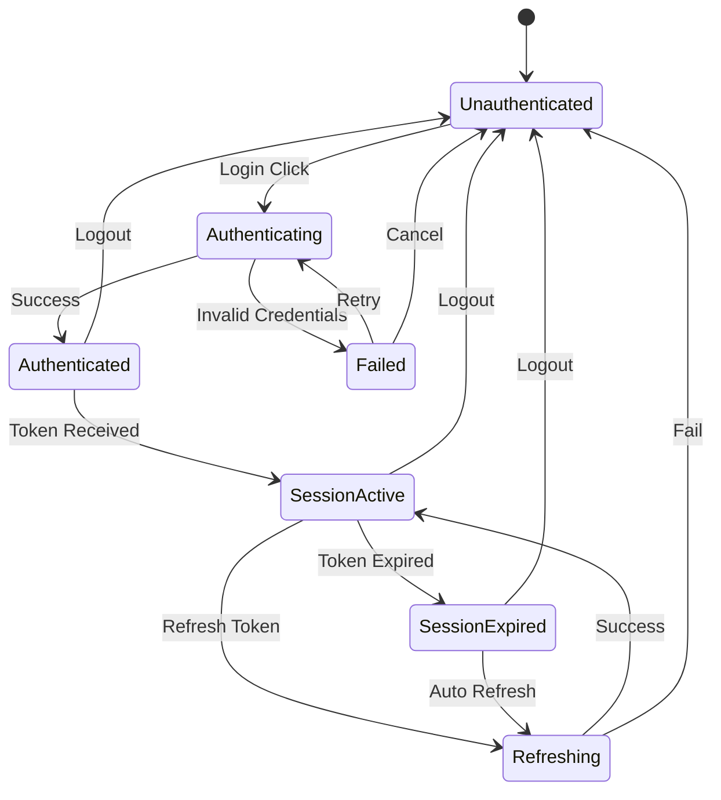

---

## Deployment Diagrams

### Production Infrastructure

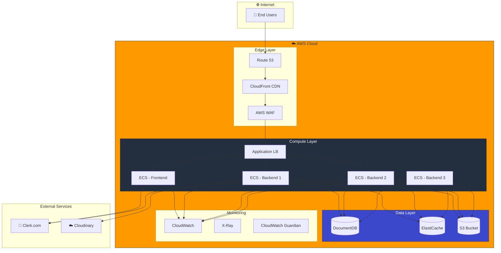

### CI/CD Pipeline

```mermaid
flowchart LR
    subgraph Code["💻 Code Stage"]
        DEV[Developer]
        IDE[VS Code]
        GIT[GitHub]
    end
    
    subgraph Build["🔨 Build Stage"]
        ACTIONS[GitHub Actions]
        TEST[Test Suite]
        BUILD[Build]
        DOCKER[Docker Build]
    end
    
    subgraph Quality["✅ Quality Stage"]
        SONAR[SonarQube]
        SEC[Security Scan]
        DEP[Dependency Check]
    end
    
    subgraph Registry["📦 Registry Stage"]
        ECR[ECR Registry]
        SCAN[Vulnerability Scan]
    end
    
    subgraph Deploy["🚀 Deploy Stage"]
        STAGING[Staging]
        APPROVAL[Manual Approval]
        PROD[Production]
    end
    
    subgraph Monitor["📊 Monitor Stage"]
        CLOUDWATCH[CloudWatch]
        ALERT[Alerting]
        DASHBOARD[Dashboard]
    end
    
    DEV --> IDE
    IDE --> GIT
    GIT --> ACTIONS
    ACTIONS --> TEST
    TEST --> BUILD
    BUILD --> DOCKER
    DOCKER --> SONAR
    SONAR --> SEC
    SEC --> DEP
    DEP --> ECR
    ECR --> SCAN
    SCAN --> STAGING
    STAGING --> APPROVAL
    APPROVAL --> PROD
    PROD --> CLOUDWATCH
    CLOUDWATCH --> ALERT
    ALERT --> DASHBOARD
```

---

## Network Diagrams

### Request/Response Flow

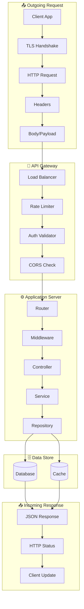

---

## Security Diagrams

### Security Architecture

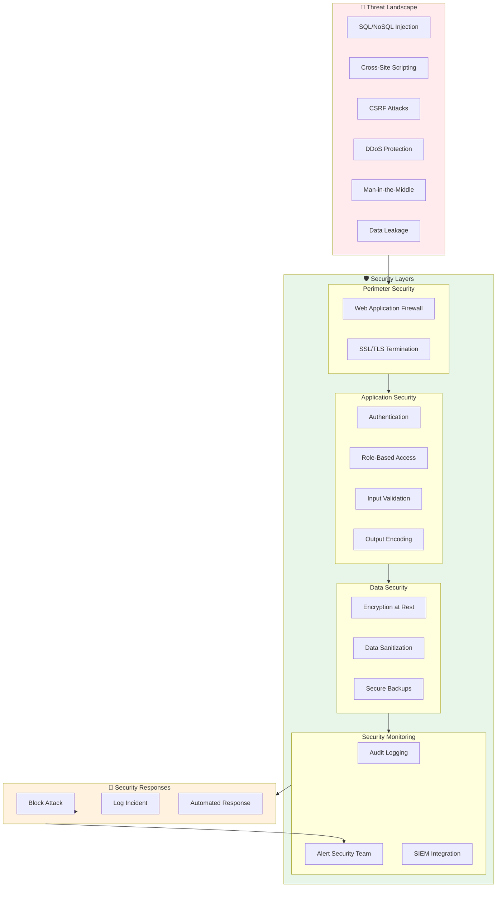

---

## Monitoring Diagrams

### Observability Stack

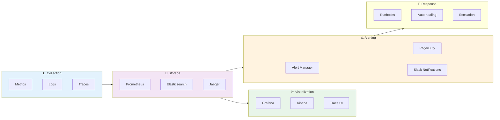

---

*End of Diagrams Document*
